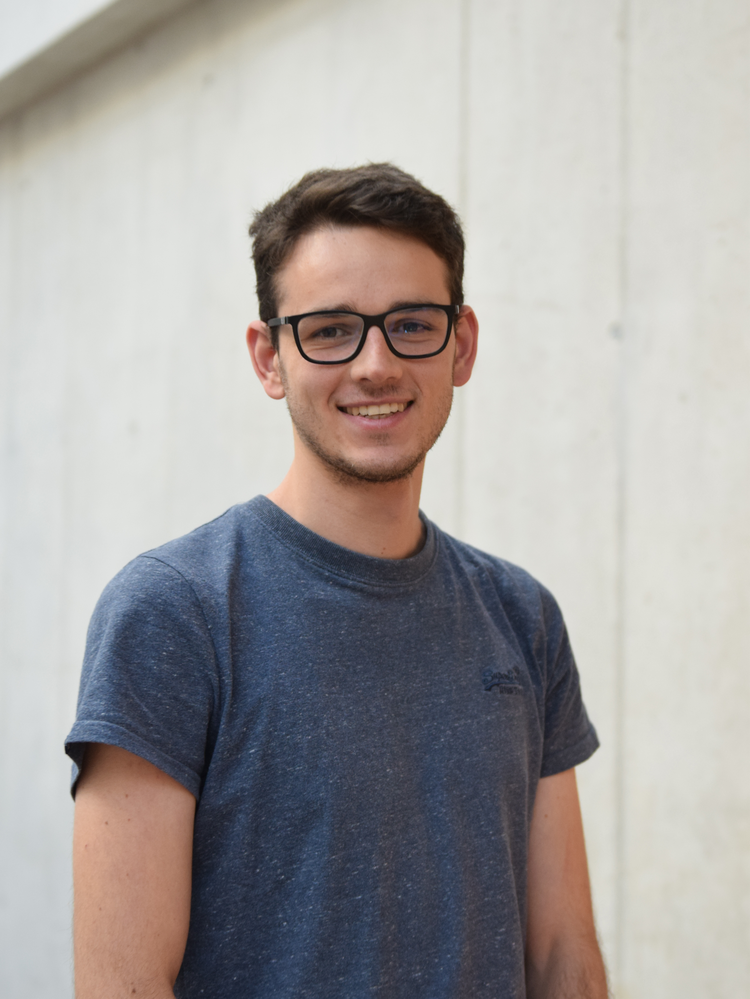
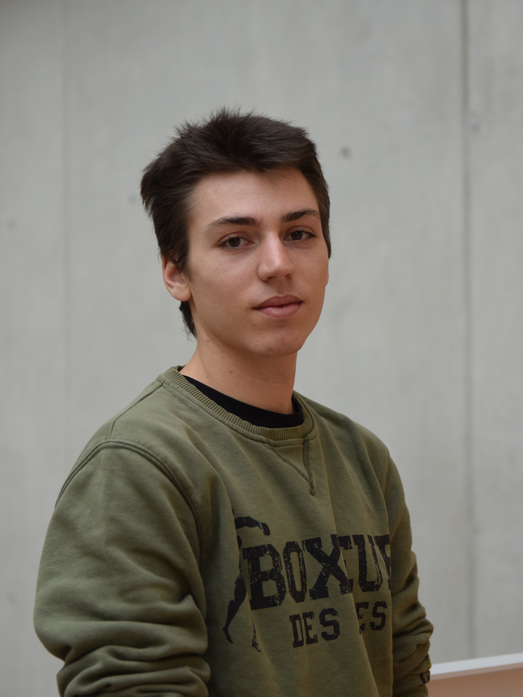
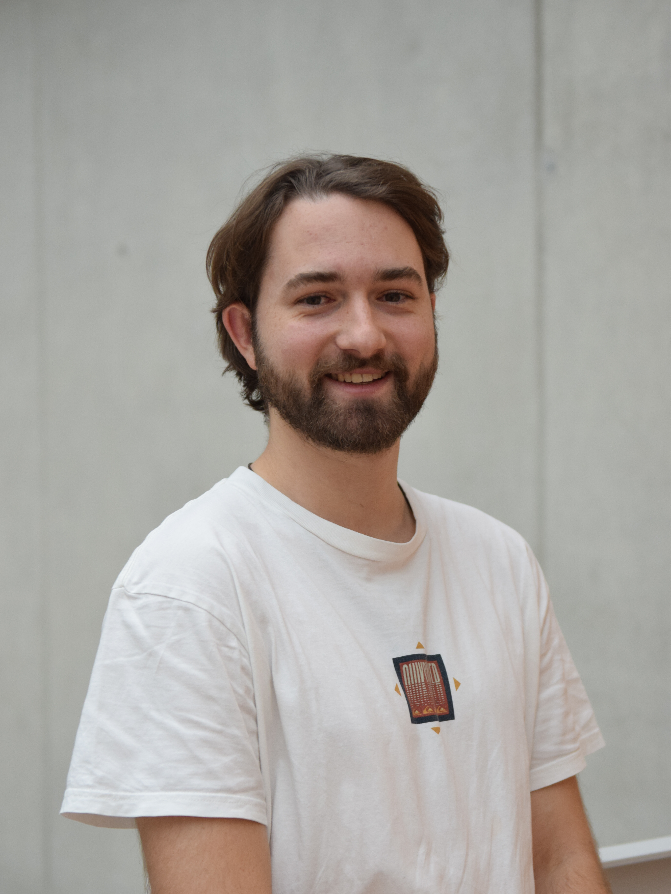
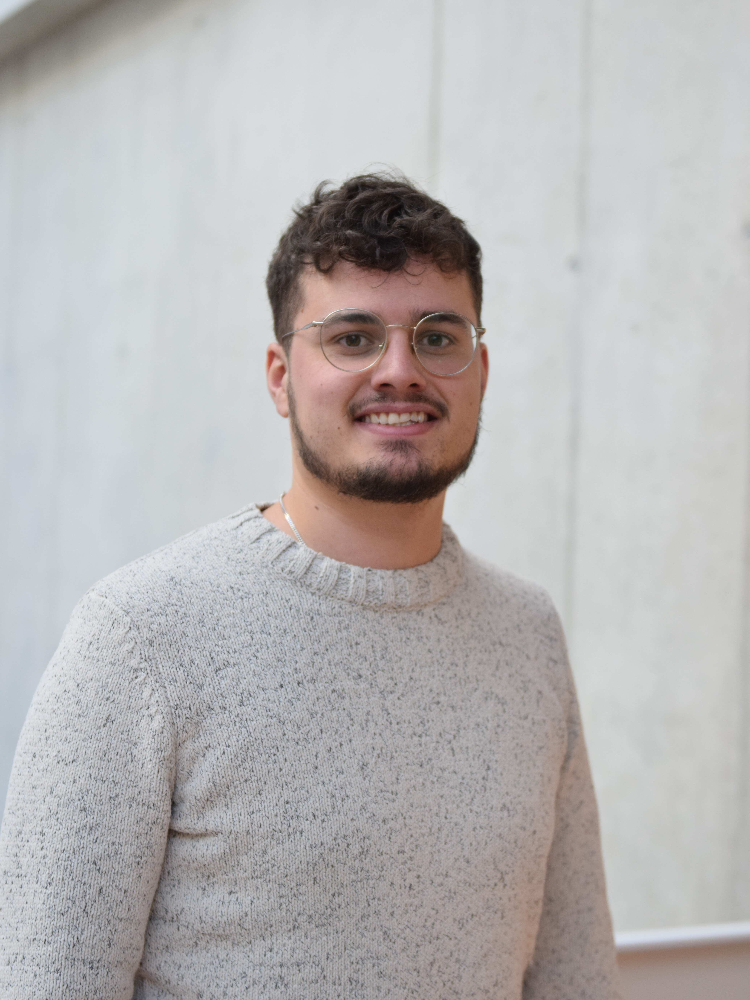
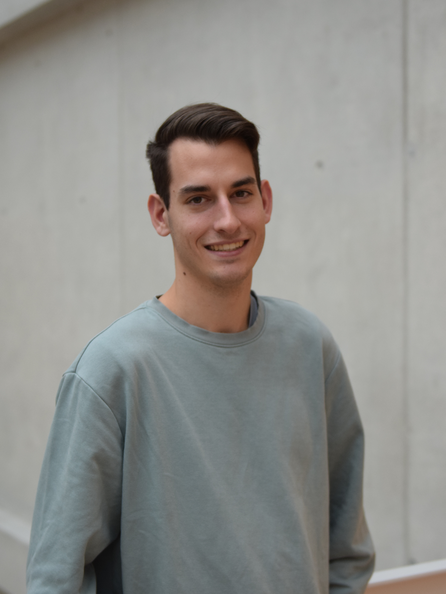

# Über uns

Wir sind das Team hinter dem Projekt **Interaktive Webkarte Ballenberg**. Unser Ziel ist es, eine benutzerfreundliche und informative Webkarte zu entwickeln, die den Besuchern des Freilichtmuseums Ballenberg ein interaktives Erlebnis bietet.
Zurzeit besuchen wir das fünfte Semester im Studiengang Geomatik an der <a href="https://www.fhnw.ch/de" target="_blank">Fachhochschule Nordwestschweiz</a> mit Schwerpunkt in Geoinformatik und Raumanalyse.

## Teammitglieder

<strong>Fabian Gross</strong> 
Unser Scrummaster und Backend-Nerd. Er liebt alles, was mit Datenbanken zu tun hat, und meidet das Frontend, als wäre es verflucht.

<strong>Mattia Verzaroli</strong> 
Mattia ist unser Sprachgenie und hält die italienische Sektion am Laufen. Ob auf Italienisch oder mit Code – er bringt alles zusammen.

<strong>Nando Amport</strong> 
Nando ist unser "Hüter des Überblicks". Niemand weiss genau, wie er das macht, aber er hat immer alles im Griff (meistens).

<strong>Nathan Matzinger</strong> 
Der Mann mit dem Auge fürs Detail. Verantwortlich für die Gestaltung – freiwillig oder unfreiwillig. Wenn es hübsch aussieht, dann wegen Nathan.

<strong>Silas Haab</strong> 
Der Python-Profi. Silas kann (fast) alles programmieren – solange es mit Python zu tun hat. Vielseitig und für jede Aufgabe zu haben.